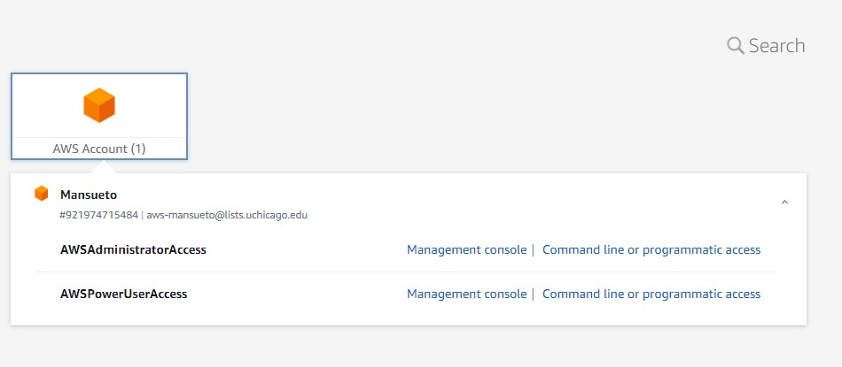
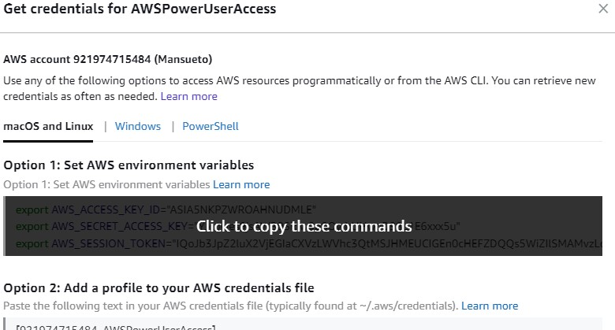

# Household Pulse Survey

Automates the processing of Census Household Pulse biweekly data into a crosstabs


## External links

* [Project workplan](https://docs.google.com/document/d/1w9o-pM68D3nr9rKDgwtDZqzrRjwVasWdZGQk5tnHXYE/edit):
  * Scope of work, check-in notes, and methodological notes.
* [Household Pulse Survey Public Use Files](https://www.census.gov/programs-surveys/household-pulse-survey/datasets.html)
* [Household Pulse Data Dictionary](https://docs.google.com/spreadsheets/d/1xrfmQT7Ub1ayoNe05AQAFDhqL7qcKNSW6Y7XuA8s8uo/edit#gid=974836931)
  * `question_labels` joins to PUF on `variable`
    * `description_recode` is a cleaned label for questions
    * `universe_recode` defines the universe that t
    he question applies to
    * `type_of_variable` describes the type of question (ID, TIME, FLAG, GEOCODE, WEIGHT, NUMERIC, QUESTION).
  * `response_labels` joins to PUF on `variable` and `value`
    * `variable_group` groups 'select all that apply questions' (useful for subsetting question groups)
    * `variable_recode` is the new variable that uniquely identifies `label_recode`
    * `label_recode` is a cleaned label for question responses
    * `do_not_join` is a flag for variables that do not have a categorical response label
  * Question and response labels are based on Phase 3 December 9-21 dictionary and should be consistent with Week 13 onwards. Note responses that contain `-99` means "Question seen but category not selected" and `-88` means "Missing / Did not report".
  * `county_metro_state` contains a county to metro or state crosswalk

## Running the workflow

### Setup

#### 1. Install the `household_pulse` package

You can do this two ways. You can either clone the repo and install the project locally, or you can install directly from GitHub. If you're running a `conda` environment, make sure to activate it before running the install.

To clone and install:

```bash
git clone https://github.com/mansueto-institute/household-pulse
pip install -e ./household-pulse/
```

If you would like to install directly:

``` bash
pip install git+https://github.com/mansueto-institute/household-pulse
```

In order to upload the results to our database you will need the RDS credentials; ask your supervisor for them.

### Run

The `household_pulse` package has a CLI that you can access like any other CLI package in Python. In order to see what you can do via the CLI, you can type:

``` bash
household-pulse --help
```

#### Subcommands

##### ETL

The main ETL actions are grouped under a CLI subcommand. You can read more about what features this has by running:

```bash
household-pulse etl --help
```

##### Downloading Data

Another of the features that the CLI has is the ability to download the processed data to a local file in case you need to work on it locally. The best idea would be to fetch the data directly from our SQL database, but this is not always possible. You can explore which datasets you can download by running:

```bash
household-pulse fetch --help
```

### Updating vignette

You first need to install the `household_pulse` package, please refer to the [Setup](#setup) section. After installing the package you need to get the AWS credentials that are required to access the storage that the package uses.

#### Getting temporary credentials

To get temporary AWS credentials you need to the [Mansueto's AWS IAM Center](https://uchicago.awsapps.com/start#/) and use your UChicago account to log in. After you log in, you should see something akin to the following screen:



You might see only one account on your end, and that is fine. Whatever account you see, click on the `Command line or programmatic access` link and now a new screen should show up that looks like this:



Make sure that you select your terminal type correctly from the menu above, and then hover the mouse over the first option; which will now tell you that you can click over the box to copy these commands. Now go to your terminal and paste what you just copied from the AWS window, and then hit enter.

This will actually set the credentials as environment variables in your current terminal session so that if you run the package from the same terminal you can have access to the storage. After the terminal is closed the credentials will be cleared. Please note that the credentials are temporary and last only for an hour. You can read more about getting credentials [here](https://docs.aws.amazon.com/singlesignon/latest/userguide/howtogetcredentials.html?icmpid=docs_sso_user_portal).

#### Running the code

Now you can actually run the sequence of commands that loads all missing weeks, smooths the estimates, builds the cache that the front-end uses and then sends a build request so that the front-end is rebuilt with the new data.

```bash
household-pulse etl --backfill
household-pulse etl --run-smoothing
household-pulse etl --build-front-cache
household-pulse etl --send-build-request
```
